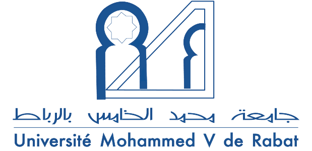
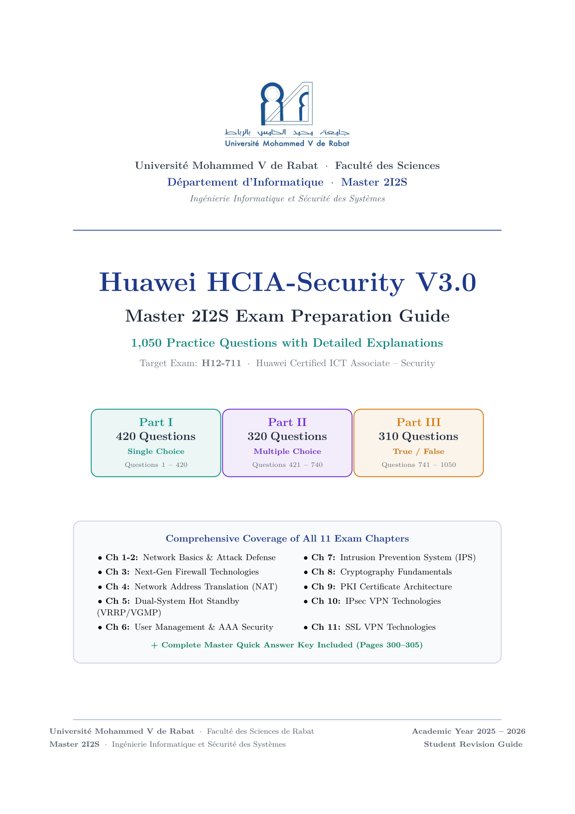
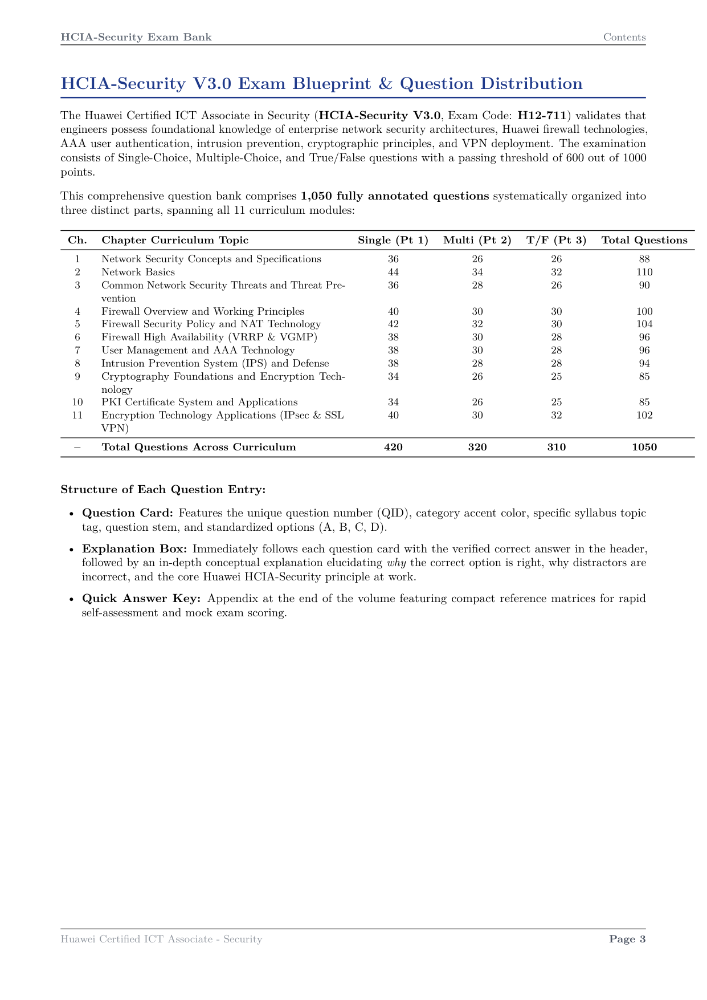

# HCIA-Security V3.0 — Master 2I2S Exam Preparation Guide
### Université Mohammed V de Rabat (UM5R) — Faculté des Sciences

<p align="center">
  
</p>

<p align="center">
  <b>Master 2I2S</b> — Ingénierie Informatique et Sécurité des Systèmes<br>
  <i>Study guide created for Master 2I2S students at UM5R in partnership with Huawei (Huawei ICT Academy) to prepare for and pass the HCIA-Security certification exam.</i>
</p>

<p align="center">
  <a href="https://e.huawei.com/en/talent/#/cert/product-details?target=_blank&category=1&certId=14">
    
  </a>
  
  <a href="data/full_question_bank.json">
    
  </a>
  <a href="HCIA_Security_1050_Questions_Master_Guide.pdf">
    
  </a>
  
</p>

---

## 👋 About This Guide

Welcome to the **Master 2I2S** Huawei HCIA-Security revision repository!

This project was created for students in our **Master 2I2S** (Ingénierie Informatique et Sécurité des Systèmes) program at **Université Mohammed V de Rabat (UM5R)**, in official partnership with **Huawei (Huawei ICT Academy)**.

As part of this partnership, validating the **Huawei Certified ICT Associate - Security (HCIA-Security, Exam H12-711)** certification is an important milestone for all Master 2I2S students. To make exam preparation as clear and stress-free as possible for everyone in our promotion, we organized **1,050 practice questions** directly from the official 499-page courseware (`HCiA.pdf`).

Every single question comes with a **simple and clear explanation** so you can understand the actual networking and security concepts instead of just memorizing letters.

---

## 🎨 Preview of the Guide

### 📌 Cover Page (Master 2I2S Edition)
Here is how the first page of our PDF guide looks:

<p align="center">
  <a href="HCIA_Security_1050_Questions_Master_Guide.pdf">
    
  </a>
</p>

### 📋 Exam Blueprint & Curriculum Breakdown (Page 4)
Here is Page 4 of the guide showing the exam specification and the question distribution across all 11 Huawei chapters:

<p align="center">
  <a href="HCIA_Security_1050_Questions_Master_Guide.pdf#page=4">
    
  </a>
</p>

---

## 📚 What's Inside? (1,050 Questions)

The guide is divided into three clear parts:

1. **Part 1: Single-Choice Questions (420 questions — Q1 to Q420)**
   - Standard 4-option questions with one correct answer.
   - Distinct teal question cards with green explanation boxes.
2. **Part 2: Multiple-Choice Questions (320 questions — Q421 to Q740)**
   - Questions where you need to select two or more correct answers.
   - Purple question cards detailing why each selected choice is right.
3. **Part 3: True / False Questions (310 questions — Q741 to Q1050)**
   - Clear true or false statements to quickly test your knowledge of key facts.
   - Amber question cards with straightforward explanations.
4. **Part 4: Master Quick Answer Key (Pages 300 to 305)**
   - Compact answer tables at the back of the book so you can do mock tests and check your score in a few minutes.

---

## 📖 All 11 Chapters Covered

Every topic from the official Huawei curriculum is covered:

| Chapter | Topic | Questions |
|:---:|:---|:---:|
| **Ch 1** | **Network Security Concepts & Standards** (CIA Triad, Security Standards, ISO 27001) | **88** |
| **Ch 2** | **Network Basics** (OSI Model, TCP/IP, Ethernet, IPv4, IPv6, Routing Basics) | **110** |
| **Ch 3** | **Network Attacks & Defense** (Port Scanning, SYN Flood, DoS/DDoS, Spoofing, Malware) | **90** |
| **Ch 4** | **Firewall Overview & Principles** (Stateful Inspection, Security Zones, Session Tables, ASPF) | **100** |
| **Ch 5** | **Firewall Security Policies & NAT** (5-Tuple Rules, Easy IP, NAPT, NAT Server) | **104** |
| **Ch 6** | **Dual-System Hot Standby** (VRRP Protocol, VGMP Groups, HRP Sync, Active/Standby) | **96** |
| **Ch 7** | **User Management & AAA** (Authentication, Authorization, RADIUS, HWTACACS, 802.1X) | **96** |
| **Ch 8** | **Intrusion Prevention System (IPS)** (Signatures, False Positives, Anti-DDoS) | **94** |
| **Ch 9** | **Cryptography Foundations** (DES, 3DES, AES, RSA, ECC, Diffie-Hellman, Hashes) | **85** |
| **Ch 10** | **PKI Certificate System** (X.509 Certificates, CA, RA, CRL, OCSP) | **85** |
| **Ch 11** | **VPN Technologies** (IPsec AH/ESP, IKEv1, IKEv2, L2TP, SSL VPN Web Proxy & Extension) | **102** |
| **Total** | **All Official Courseware Modules** | **1,050** |

---

## 📄 Download the PDF

The complete PDF book is compiled and ready to read:

👉 **[Download `HCIA_Security_1050_Questions_Master_Guide.pdf`](HCIA_Security_1050_Questions_Master_Guide.pdf)** *(305 pages, 1.5 MB)*

---

## 🎓 Exam Information & Passing Tips

- **Exam Name:** Huawei Certified ICT Associate - Security
- **Exam Code:** H12-711
- **Duration:** 90 Minutes
- **Question Count on Exam:** ~60 questions
- **Passing Score:** 600 / 1000 points (60%)
- **How to Study:**
  1. Go through one chapter at a time.
  2. Try answering the questions before looking at the answer.
  3. Read the green explanation box carefully, especially when you get an answer wrong.
  4. Use the tables in Part 4 for a quick final review before taking your exam.

---

## 📁 Repository Structure 

```text
├── HCIA_Security_1050_Questions_Master_Guide.pdf  # The full 305-page PDF book
├── main.tex                                       # LaTeX document root
├── preamble.tex                                   # Document styling & packages
├── HCiA.pdf                                       # Official 499-page courseware PDF
│
├── assets/
│   ├── um5r_logo.png                              # Official UM5R University logo
│   ├── cover_preview.png                          # Preview of the cover page
│   ├── page_4_preview.png                         # Exam blueprint & syllabus (Page 4)
│   ├── sample_single_choice.png                   # Single-choice question preview
│   ├── sample_multi_choice.png                    # Multiple-choice question preview
│   ├── sample_true_false.png                      # True/False question preview
│   └── sample_answer_key.png                      # Answer key preview
│
├── chapters/                                      # LaTeX files for each part
│   ├── exam_blueprint.tex                         # Syllabus & exam breakdown
│   ├── part1_single_choice.tex                    # Questions 1 to 420
│   ├── part2_multi_choice.tex                     # Questions 421 to 740
│   ├── part3_true_false.tex                       # Questions 741 to 1050
│   └── quick_answer_key.tex                       # Answer matrices
│
├── data/
│   └── full_question_bank.json                    # Complete 1,050 questions in JSON
│
└── scripts/
    ├── build_full_database.py                     # Script to assemble all questions
    └── generate_ch01_to_ch03.py ... ch11.py       # Chapter question generators
```

---

Good luck to everyone in Master 2I2S! Let's all pass our HCIA-Security certification! 🎓🔒
