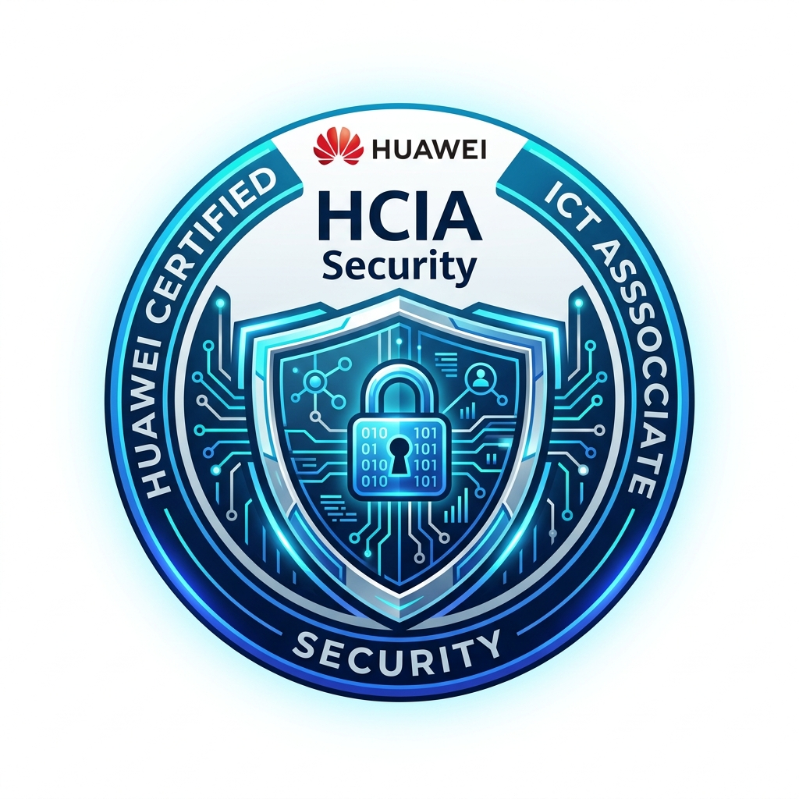
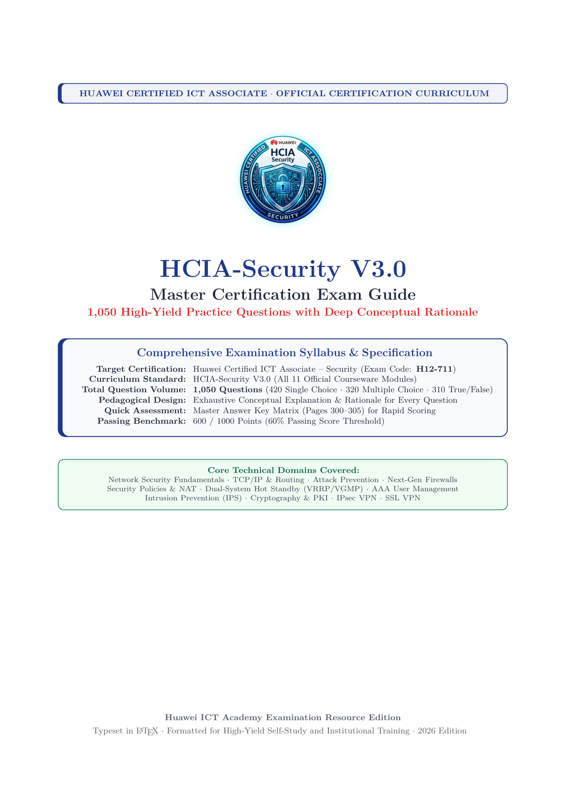
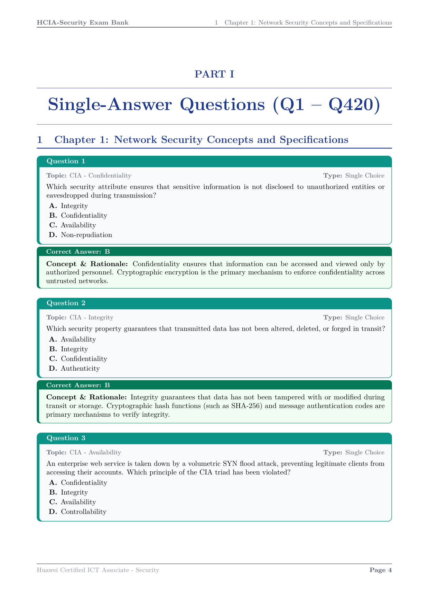
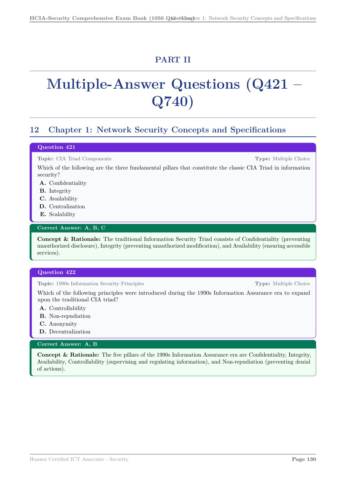
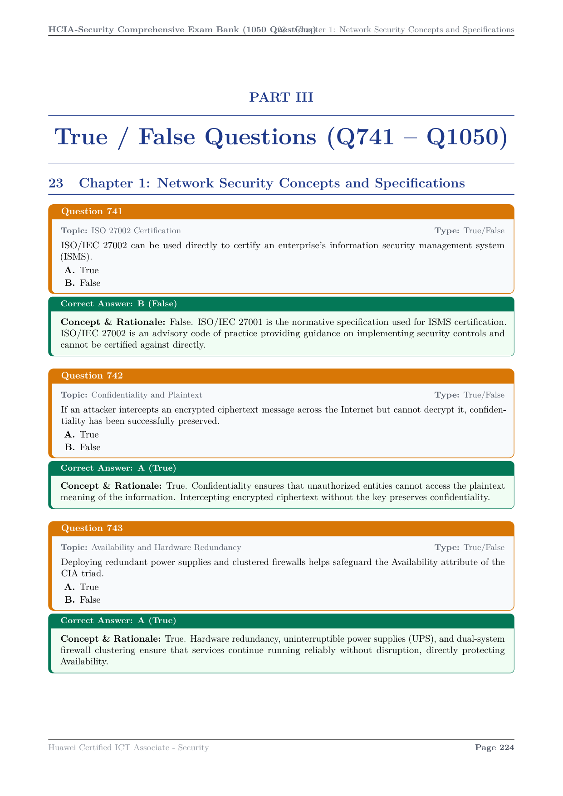
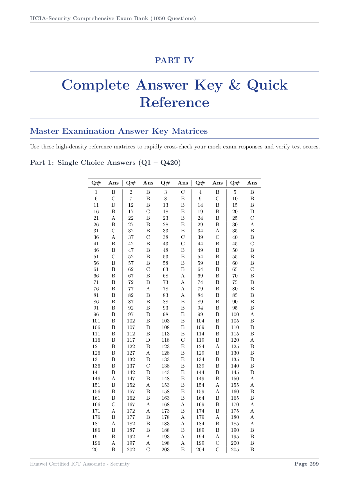

# Huawei HCIA-Security V3.0 Master Exam Question Bank
### Comprehensive 1,050-Question Certification Preparation Guide & Conceptual Walkthrough

<p align="center">
  
</p>

<p align="center">
  <a href="https://e.huawei.com/en/talent/#/cert/product-details?target=_blank&category=1&certId=14">
    
  </a>
  
  <a href="data/full_question_bank.json">
    
  </a>
  <a href="HCIA_Security_1050_Questions_Master_Guide.pdf">
    
  </a>
  
</p>

---

<p align="center">
  
  <br>
  <strong>Official-Grade HCIA-Security V3.0 Exam Preparation Resource</strong>
</p>

An authoritative, publication-ready examination guide engineered for network security engineers, IT professionals, and students preparing for the **Huawei Certified ICT Associate in Security (HCIA-Security V3.0, Exam Code: H12-711)** certification.

---

## 📑 Quick Navigation
- [Book Cover Preview](#-book-cover-preview)
- [Key Features](#-key-features)
- [Curriculum & Question Distribution](#-curriculum-syllabus--question-distribution)
- [Visual Design & Sample Pages](#-visual-design--sample-pages)
- [Repository Structure](#-repository-structure)
- [Compilation & Build Guide](#-compilation--build-guide)
- [Exam Overview & Strategy](#-exam-overview--strategy)
- [License & Disclaimer](#-license--disclaimer)

---

## 🎨 Book Cover Preview

<p align="center">
  
</p>

---

## 🌟 Key Features

- **1,050 High-Yield Practice Questions**:
  - **Part 1 (Single-Answer Questions)**: 420 Questions (Q1 – Q420)
  - **Part 2 (Multiple-Answer Questions)**: 320 Questions (Q421 – Q740)
  - **Part 3 (True / False Questions)**: 310 Questions (Q741 – Q1050)
- **Comprehensive Conceptual Explanations**: Every question includes a dedicated explanation card detailing *why* the correct answer is right, why distractors are wrong, and explaining the fundamental Huawei security principles.
- **100% Official Curriculum Coverage**: Exhaustive coverage across all 11 modules in the official 499-page Huawei courseware (`HCiA.pdf`).
- **Master Quick-Reference Answer Key**: High-density 5-column answer matrices at the back of the book (Pages 300–305) for rapid scoring of mock exams.
- **Publication-Ready LaTeX Formatting**: Dual-card structure built with `tcolorbox`, distinct color badges per question type, clear typographic hierarchy, and interactive PDF hyperlinks.

---

## 📊 Curriculum Syllabus & Question Distribution

| Ch. | Curriculum Module | Single Choice (Pt 1) | Multi Choice (Pt 2) | True / False (Pt 3) | Module Total |
|:---:|:---|:---:|:---:|:---:|:---:|
| **1** | **Network Security Concepts & Specifications**<br><sub>CIA triad, security standards, ISO/IEC 27001, China Classified Protection 2.0</sub> | 36 | 26 | 26 | **88** |
| **2** | **Network Basics**<br><sub>OSI 7-layer model, TCP/IP, Ethernet II frames, IPv4/IPv6 addressing, ICMP, ARP, routing basics</sub> | 44 | 34 | 32 | **110** |
| **3** | **Common Network Threats & Threat Prevention**<br><sub>Port scanning, SYN Flood, UDP/ICMP Flood, ARP spoofing, IP spoofing, malware, phishing</sub> | 36 | 28 | 26 | **90** |
| **4** | **Firewall Overview & Working Principles**<br><sub>Stateful inspection, security zones (Trust, Untrust, DMZ, Local), ASPF, session tables, server-map</sub> | 40 | 30 | 30 | **100** |
| **5** | **Firewall Security Policies & NAT Technologies**<br><sub>Security policy rules, 5-tuple matching, Easy IP, NAPT, NAT No-PAT, NAT Server, Smart NAT</sub> | 42 | 32 | 30 | **104** |
| **6** | **Dual-System Hot Standby & High Availability**<br><sub>VRRP protocol, VGMP management groups, HRP redundancy protocol, Active/Standby, Active/Active</sub> | 38 | 30 | 28 | **96** |
| **7** | **User Management & AAA Technologies**<br><sub>Authentication, Authorization, Accounting, RADIUS, HWTACACS, LDAP, AD, 802.1X, Portal, SACG</sub> | 38 | 30 | 28 | **96** |
| **8** | **Intrusion Prevention System (IPS)**<br><sub>Signature-based detection, behavioral analysis, false positive suppression, Anti-DDoS, traffic scrubbing</sub> | 38 | 28 | 28 | **94** |
| **9** | **Cryptography Foundations**<br><sub>Symmetric encryption (DES, 3DES, AES), Asymmetric encryption (RSA, ECC, DH), Hashes (MD5, SHA-1, SHA-2)</sub> | 34 | 26 | 25 | **85** |
| **10** | **PKI Certificate System & Applications**<br><sub>ITU-T X.509 certificates, CA, RA, CRL, OCSP, SCEP, digital signatures, certificate validation chains</sub> | 34 | 26 | 25 | **85** |
| **11** | **Encryption Technology Applications (IPsec & SSL VPN)**<br><sub>GRE over IPsec, AH (51), ESP (50), Transport/Tunnel modes, IKEv1 (Main/Aggressive/Quick), IKEv2, NAT-T, DPD, L2TP, SSL VPN (Web Proxy, File Sharing, Port Forwarding, Network Extension)</sub> | 40 | 30 | 32 | **102** |
| **--** | **Grand Totals Across Curriculum** | **420** | **320** | **310** | **1,050** |

---

## 📸 Visual Design & Sample Pages

### 1. Part 1: Single-Choice Questions (Teal Theme `#0D9488`)
Each question card features syllabus topic tags, question stems, standardized options, and an accompanying green explanation box.

<p align="center">
  
</p>

---

### 2. Part 2: Multiple-Choice Questions (Purple Theme `#6D28D9`)
Multiple-choice questions feature a purple theme with all correct options listed in the explanation header and complete conceptual rationale.

<p align="center">
  
</p>

---

### 3. Part 3: True / False Questions (Amber Theme `#D97706`)
True/False questions use an amber banner with explicit True/False verdicts and technical justifications.

<p align="center">
  
</p>

---

### 4. Part 4: Master Quick-Reference Answer Key
High-density 5-pair table matrices (Pages 300–305) provide candidates with instant mock exam grading.

<p align="center">
  
</p>

---

## 🗂️ Repository Structure

```text
├── HCIA_Security_1050_Questions_Master_Guide.pdf  # Final Compiled 305-Page Master PDF Book
├── main.tex                                       # Main LaTeX source document
├── preamble.tex                                   # Layout, typography, colors & tcolorbox cards
├── HCiA.pdf                                       # Official 499-page Courseware reference
│
├── assets/                                        # Visual Assets & Screenshots
│   ├── hcia_exam_banner.jpg                       # High-tech panoramic header banner
│   ├── hcia_security_badge.jpg                    # High-resolution certification emblem
│   ├── cover_page_preview.png                     # PDF cover page rendering
│   ├── sample_single_choice.png                   # Part 1 page preview
│   ├── sample_multi_choice.png                    # Part 2 page preview
│   ├── sample_true_false.png                      # Part 3 page preview
│   └── sample_answer_key.png                      # Part 4 answer key preview
│
├── chapters/                                      # Modular LaTeX Question Files
│   ├── exam_blueprint.tex                         # Syllabus blueprint & scoring guide
│   ├── part1_single_choice.tex                    # 420 Single Choice Questions (Q1 - Q420)
│   ├── part2_multi_choice.tex                     # 320 Multiple Choice Questions (Q421 - Q740)
│   ├── part3_true_false.tex                       # 310 True / False Questions (Q741 - Q1050)
│   └── quick_answer_key.tex                       # Quick Reference Master Answer Key
│
├── data/                                          # Structured JSON Datasets
│   └── full_question_bank.json                    # All 1,050 questions with complete metadata
│
├── scripts/                                       # Python Question Generators & Build Pipeline
│   ├── build_full_database.py                     # Aggregator & LaTeX export pipeline
│   ├── generate_ch01_to_ch03.py                   # Chapter 1 generator
│   ├── generate_ch2.py to generate_ch11.py        # Chapters 2 through 11 generators
│
└── .gitignore                                     # Clean filter for LaTeX/Python artifacts
```

---

## 🛠️ Compilation & Build Guide

### Direct Access
The compiled volume is ready to read:
- **[`HCIA_Security_1050_Questions_Master_Guide.pdf`](HCIA_Security_1050_Questions_Master_Guide.pdf)** (305 pages, 1.4 MB)

### Recompiling with LaTeX
To re-compile the book from LaTeX source, ensure you have TeX Live / MacTeX installed:

```bash
# Run pdflatex twice to synchronize TOC, cross-references, and bookmarks
pdflatex -interaction=nonstopmode main.tex
pdflatex -interaction=nonstopmode main.tex

# Copy to release target
cp main.pdf HCIA_Security_1050_Questions_Master_Guide.pdf
```

### Rebuilding the Question Database
If you modify questions in any `scripts/generate_ch*.py` file, re-export the LaTeX chapters and JSON database:

```bash
python3 scripts/build_full_database.py
```

---

## 🎓 Exam Overview & Strategy

| Parameter | Specification |
|:---|:---|
| **Certification Name** | Huawei Certified ICT Associate - Security |
| **Exam Code** | **H12-711** |
| **Exam Format** | Single Choice, Multiple Choice, True / False |
| **Question Count** | ~60 questions (in actual live exam) |
| **Exam Duration** | 90 Minutes |
| **Total Score** | 1,000 Points |
| **Passing Score** | **600 Points** (60%) |
| **Recommended Strategy** | Review each question card first; self-assess using the Answer Key, and thoroughly study the Explanation Box for any incorrect answers to solidify the core principles. |

---

## 📄 License & Disclaimer

This preparation bank was authored for educational, training, and certification preparation purposes aligned with the Huawei Certified ICT Associate (HCIA) curriculum. All Huawei product names, logos, trademarks, and registered trademarks (`USG`, `SecoPath`, `HRP`, `VGMP`) are property of Huawei Technologies Co., Ltd.
